# Guide on Mnemonic / Seed Phrase, Keys, and Addresses on Cardano
A step-by-step guide on **how mnemonic works** (specifically on **Cardano** using `cardano-cli` and `cardano-wallet`), from deriving keys to using the address and signing transactions

**TABLE OF CONTENT**

- [Guide on Mnemonic / Seed Phrase, Keys, and Addresses on Cardano](#guide-on-mnemonic--seed-phrase-keys-and-addresses-on-cardano)
  - [✅ Prerequisites](#-prerequisites)
    - [Install `cardano-node` and `cardano-cli`](#install-cardano-node-and-cardano-cli)
    - [Install `cardano-wallet`](#install-cardano-wallet)
    - [Add directory to `$PATH`](#add-directory-to-path)
    - [Check if installed correctly](#check-if-installed-correctly)
  - [📝 Generate Mnemonic or Seed Phrase](#-generate-mnemonic-or-seed-phrase)
  - [🔑 Create and Derive Keys – *private, public, signing, and verify keys*](#-create-and-derive-keys--private-public-signing-and-verify-keys)
    - [Account Keys](#account-keys)
    - [Payment and Stake Keys](#payment-and-stake-keys)
    - [Shelley Format Keys](#shelley-format-keys)
  - [🏠 Create Account Addresses – *testnet and mainnet*](#-create-account-addresses--testnet-and-mainnet)
    - [Build Addresses - Testnet (Preprod)](#build-addresses---testnet-preprod)
    - [Build Addresses - Mainnet](#build-addresses---mainnet)

## ✅ Prerequisites

### Install `cardano-node` and `cardano-cli`
1. Go to [IOHK - Cardano Node](https://github.com/input-output-hk/cardano-node/tree/1.35.3) repository on Github
2. Scroll down to *Executables*, and download the binaries for your specific OS (MacOS, Linux, or Windows). For this demonstration, we're using node version 1.35.3
3. Extract and copy the files to `~/.local/bin-cardano/node-1.35.3/`

### Install `cardano-wallet`
1. Go to [IOHK - Cardano Wallet](https://github.com/input-output-hk/cardano-wallet/releases/tag/v2022-08-16) repository on Github
2. Download the binaries for your OS (MacOS, Linux, or Windows)
3. Extract and copy the files to `~/.local/bin-cardano/wallet-v2022-08-16/`

### Add directory to `$PATH`
1. Edit `~/.zshrc` or `~/.bashrc`
2. Insert this `PATH` at the bottom
    ```bash
    ...
    # Path for cardano-node, cardano-cli, and cardano-wallet
    export PATH="$HOME/.local/bin-cardano/wallet-v2022-08-16:$PATH"
    export PATH="$HOME/.local/bin-cardano/node-1.35.3:$PATH"
    ```
    > **Note**: *there's some reduncancy with some files, such as `cardano-node` and `cardano-cli` exist in both directories. The order of `PATH` declaration will determine which file will be used. In this case, the environment will use the `cardano-node` directory for redundant files.*

### Check if installed correctly
1. Open new terminal session
2. Check the version for each command
   ```bash
   $ cardano-node --version
   # cardano-node 1.35.3 - darwin-x86_64 - ghc-8.10
   # git rev 950c4e222086fed5ca53564e642434ce9307b0b9

   $ cardano-cli --version
   # cardano-cli 1.35.3 - darwin-x86_64 - ghc-8.10
   # git rev 950c4e222086fed5ca53564e642434ce9307b0b9

   $ cardano-wallet version
   # v2022-08-16 (git revision: afe575663a866c612b4a4dc3a90a8a700e387a86)
   ```
   > **Note**: *for Mac users, if you encounter any Security issues, open **Apple > System Preferences > Security & Privacy**, and click 'Allow' when prompted*

## 📝 Generate Mnemonic or Seed Phrase
To put it simply, **mnemonic or seed phrase is a random number used for your private key represented in a human readable words.** These words are specified in the BIP39 wordlist

1. Generate 24 seed phrase using. This is done locally and doesn't require internet connection
    ```bash
    $ cardano-wallet recovery-phrase generate --size 24 | tee mnemonic.txt
    ```
    > **Note**: `tee` command means ***write the output into this file, while also echo the output into the terminal***

    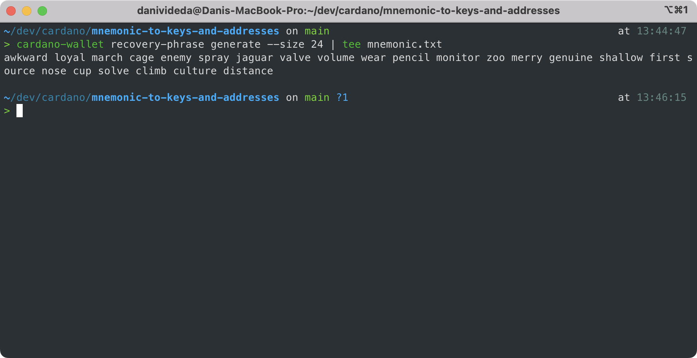

2. Convert the seed phrase into Master Root Key 
    ```bash
    $ cardano-wallet key from-recovery-phrase Shelley < mnemonic.txt | tee keys/root.xprv
    ```
    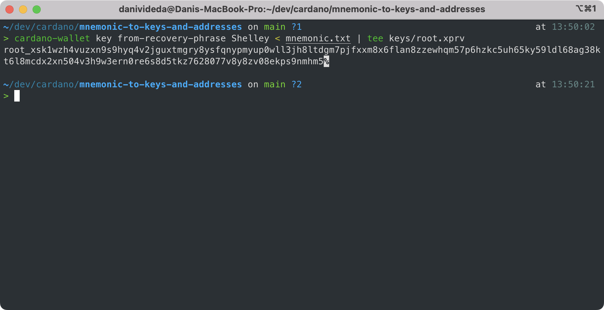

## 🔑 Create and Derive Keys – *private, public, signing, and verify keys*

Cardano uses [Hierarchical Deterministic Wallet](https://input-output-hk.github.io/cardano-wallet/concepts/hierarchical-deterministic-wallets), and further standardized in [CIP-1852](https://github.com/cardano-foundation/CIPs/tree/master/CIP-1852). Cardano adapt the BIP32 standard in Bitcoin, but it's modified to accomodate Ed25519

For Cardano, the derivation path would be: 
```
m / 1852' / 1815' / account' / role / index
```
Description:
1. `m` : Root Master Key
2. `1852'` : Purpose → taken from the year of death of **Ada Lovelace**
3. `1815'` : Coin type → taken from the year of birth of **Ada Lovelace**
4. `account'` : 0 .. 23 → number of accounts (explained later)
5. `role` : 
   1. `0` to indicate an address on the **external** chain, that is, an address that is **meant to be public and communicated to other users** 
   2. `1` to indicate an address on the **internal** chain, that is, an address that is **meant for change**, generated by a wallet software
   3. `2` to indicate a reward account address, used for delegation
6. `index` :
   1. `0` if the `role` is `2`
   2. Anything between 0 and 2<sup>23</sup> otherwise

### Account Keys
One seed phrase can generate many accounts and use them seperately.

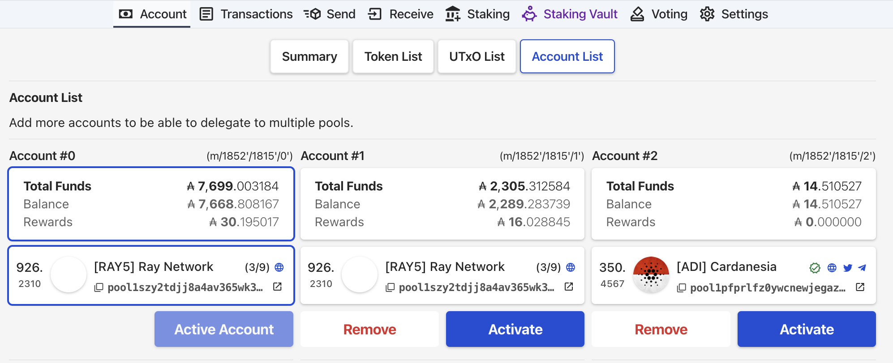

When using Eternl wallet, you can see the HD Wallets deriviation path on each account; `(m/1852'/1815'/0'), (m/1852'/1815'/1'), and (m/1852'/1815'/2')`

**Steps to create these accounts:**

1. Derive a key from the **MasterKey** (`root.xprv`) to create an `ExtendedPrivateKey` for **Account#0**
   ```bash
   $ cardano-wallet key child 1852H/1815H/0H < keys/root.xprv | tee keys/account0.xprv
   ```
2. Create the `ExtendedPublicKey` using the **Account#0** `ExtendedPrivateKey`
   ```bash
   $ cardano-wallet key public --with-chain-code < keys/account0.xprv | tee keys/account0.xpub
   ```
   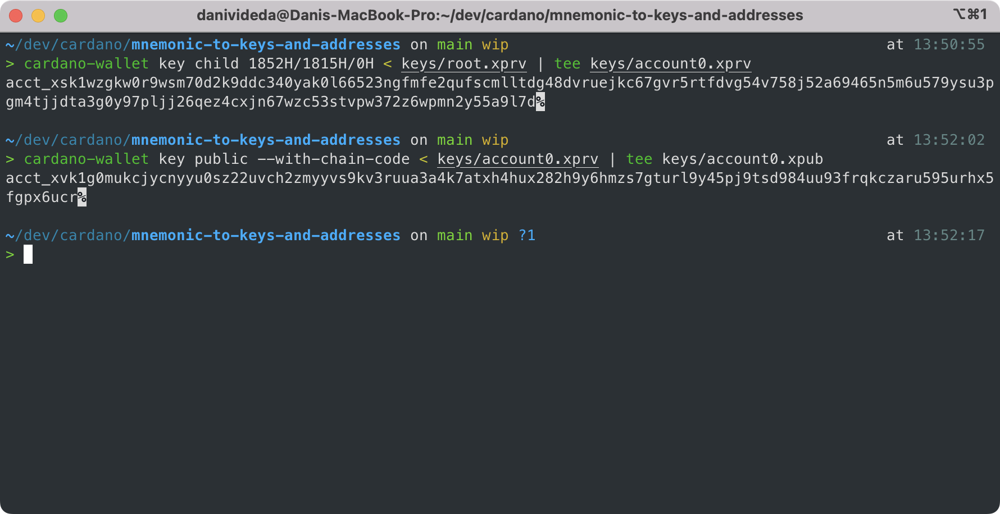
3. Repeat the step if you want to create additional accounts, e.g `1852H/1815H/1H`, `1852H/1815H/2H`, and so on
  
### Payment and Stake Keys
Every account have **their own set of addresses**. An address is nothing more than a **hashed public keys**. In *Shelley Era*, an address consist of 2 different public key, a **payment key** and a **stake key**. As specified in [CIP-1852](https://github.com/cardano-foundation/CIPs/tree/master/CIP-1852), we will derive those 2 keys from the `ExtendedPrivateKey` of **Account#0**

***Payment key***
1. The full derivation path from the **MasterKey** would be 
  ```
  m / 1852' / 1815' / 0' / 0 / 0
  ```
2. The last two number defines `role` and `index`, as already explained previously
3. Since we've already derived **Account#0**, we just need derive it further with `0/0`
   ```bash
   $ cardano-wallet key child 0/0 < keys/root.xprv | tee keys/account0_idx0.xprv
   ```

   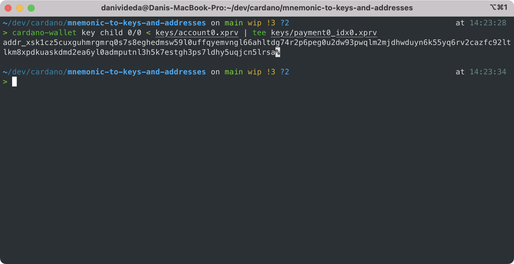
4. If you want to create another payment key, repeat the process with increment for the last value, like so `0/1`, `0/2`, `0/3`, and so on.

***Stake key***
1. The full derivation path from the **MasterKey** would be 
  ```
  m / 1852' / 1815' / 0' / 2 / 0
  ```
2. The last two number defines `role` and `index`, as already explained previously
3. Note that **there's only 1** stake key for each account, so the `index` will always be `0`
4. Derive the key like we did in payment key
   ```bash
   $ cardano-wallet key child 2/0 < keys/account0.xprv | tee keys/stake0.xprv
   ```

   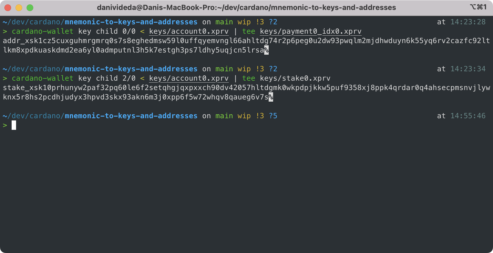

> **Note**: we've only created the `ExtendedPrivateKey` for both payment and stake key, and not `ExtendedPublicKey` that we've done previously. This is because we will convert the payment and stake key private keys into Shelley compatible format first, and then we can create the public key in Shelley format. Shelley format is needed to create addresses, build transaction, and submit transaction using `cardano-cli`.

### Shelley Format Keys
So far, we've created private keys for **MasterKey**, **Account#0**, payment, and stake keys.
```bash
# Master
root_xsk1wzh4vuzxn9s9hyq4v2jguxtmgry8ysfqnypmyup0wll3jh8ltdgm7pjfxxm8x6flan8zzewhqm57p6hzkc5uh65ky59ldl68ag38kt6l8mcdx2xn504v3h9w3ern0re6s8d5tkz7628077v8y8zv08ekps9nmhm5

# Account#0
acct_xsk1wzgkw0r9wsm70d2k9ddc340yak0l66523ngfmfe2qufscmlltdg48dvruejkc67gvr5rtfdvg54v758j52a69465n5m6u579ysu3pgm4tjjdta3g0y97pljj26qez4cxjn67wzc53stvpw372z6wpmn2y55a9l7d

# Payment
addr_xsk1cz5cuxguhmrgmrq0s7s8eghedmsw59l0uffqyemvngl66ahltdg74r2p6peg0u2dw93pwqlm2mjdhwduyn6k55yq6rv2cazfc92ltlkm8xpdkuaskdmd2ea6yl0admputnl3h5k7estgh3ps7ldhy5uqjcn5lrsa

# Stake
stake_xsk10prhunyw2paf32pq60le6f2setqhgjqxpxxch90dv42057hltdgmk0wkpdpjkkw5puf9358xj8ppk4qrdar0q4ahsecpmsnvjlywknx5r8hs2pcdhjudyx3hpvd3skx93akn6m3j0xpp6f5w72whqv8qaueg6v7s
```

Before we can create addresses, signing transaction, or doing anything with `cardano-cli`, we need to convert these keys into a **Shelley compatible format**.
> **Note**: for the next section, `ExtendedPrivateKey` and `ExtendedSigningKey` are actually the same thing in terms of underlying principle, same goes with `ExtendedPublicKey` and `ExtendedVerifyKey`. I use the name seperately just to differentiate between the **Shelley format** and the **regular or bech32 format**. 

For this section, we will do the following:
1. Convert Payment Key into Shelley format
2. Convert Stake Key into Shelley format
3. Create a public key for Payment Key using the Payment Key that has been converted into Shelley format
4. Create a public key for Stake Key using the Stake Key that has been converted into Shelley format

**Step:**

1. Convert `payment0_idx0.xprv` into `payment0_idx0.xskey` 
   ```bash
   $ cardano-cli key convert-cardano-address-key \
   --shelley-payment-key \
   --signing-key-file keys/payment0_idx0.xprv \
   --out-file keys/payment0_idx0.xskey
   ```
   This will create `ExtendedSigningKey`, which is a payment key in **Shelley format**

   
2. Convert `stake0.xprv` into `stake0.xskey`
   ```bash
   $ cardano-cli key convert-cardano-address-key \
   --shelley-stake-key \
   --signing-key-file keys/stake0.xprv \
   --out-file keys/stake0.xskey
   ```
   This will create `ExtendedSigningKey` for the stake key in Shelley format

   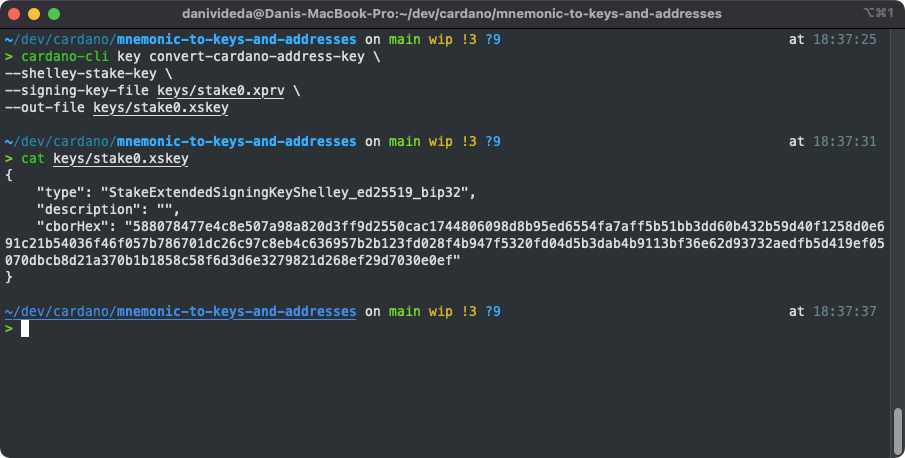

After we convert the `ExtendedPrivateKey` into `ExtendedSigningKey`, we can then create the `ExtendedPublicKey` into a Shelley format `ExtendedVerifyKey`

3. Generate the verify key from `payment0_idx0.xskey`
   ```bash
   $ cardano-cli key verification-key \
   --signing-key-file keys/payment0_idx0.xskey \
   --verification-key-file keys/payment0_idx0.xvkey
   ```

   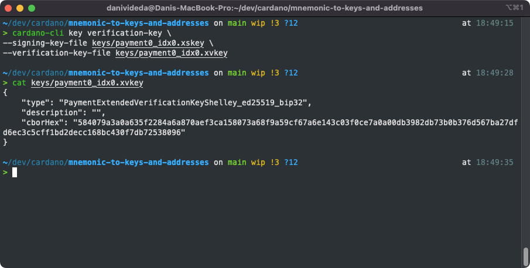
4. Generate the verify key from `stake0.xskey`
   ```bash
   $ cardano-cli key verification-key \
   --signing-key-file keys/stake0.xskey \
   --verification-key-file keys/stake0.xvkey
   ```

   

**Done!**
We have completed the steps on deriving keys necessary for later uses, such as creating addresses and signing transactions.

## 🏠 Create Account Addresses – *testnet and mainnet*
Before we continue, we need to convert the `ExtendedVerifyKey` into a shortened key version `VerifyKey`
1. Shorten the `payment0_idx0.xskey` into `payment0_idx0.vkey`
   ```bash
   $ cardano-cli key non-extended-key \
   --extended-verification-key-file keys/payment0_idx0.xvkey \
   --verification-key-file keys/payment0_idx0.vkey
   ```

   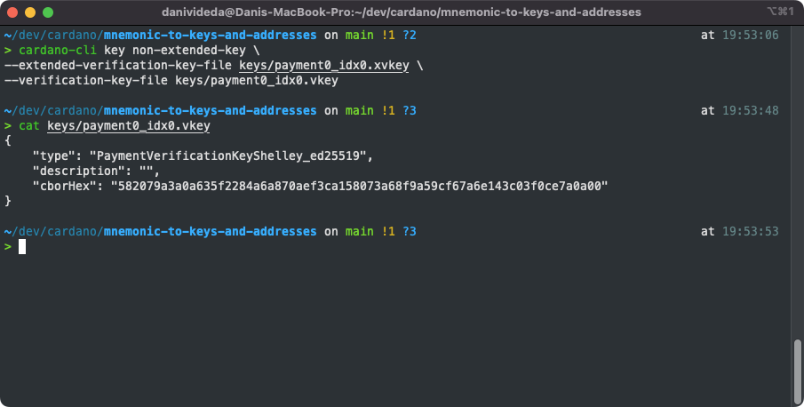
2. Shorten the `stake0.xskey` into `stake0.vkey`
   ```bash
   $ cardano-cli key non-extended-key \
   --extended-verification-key-file keys/stake0.xvkey \
   --verification-key-file keys/stake0.vkey
   ```

   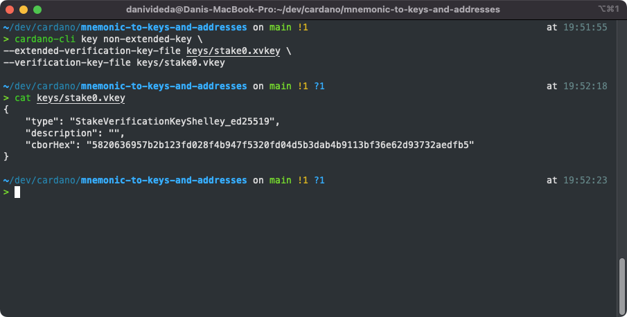

Now we can create the addresses using both `VerifyKey` for the Payment and Stake key

### Build Addresses - Testnet (Preprod)
It's fairly simple and easy to build addresses when we have those two `VerifyKey` prepared. As of now, there are 3 testnet: Legacy, Preview, and Preprod. The legacy testnet will be deprecated, and now we will use the Preprod. We use this because [Cardanoscan Testnet](testnet.cardanoscan.io) is using the Preprod version of testnet. From this [Getting Started Testnet](https://docs.cardano.org/cardano-testnet/getting-started) doc, we will use `INTEGER: 2` for the testnet magic number.

1. Build the address
   ```bash
   cardano-cli address build \
   --payment-verification-key-file keys/payment0_idx0.vkey \
   --stake-verification-key-file keys/stake0.vkey \
   --testnet-magic 2 \
   --out-file addresses/account0_idx0.addr
   ```
   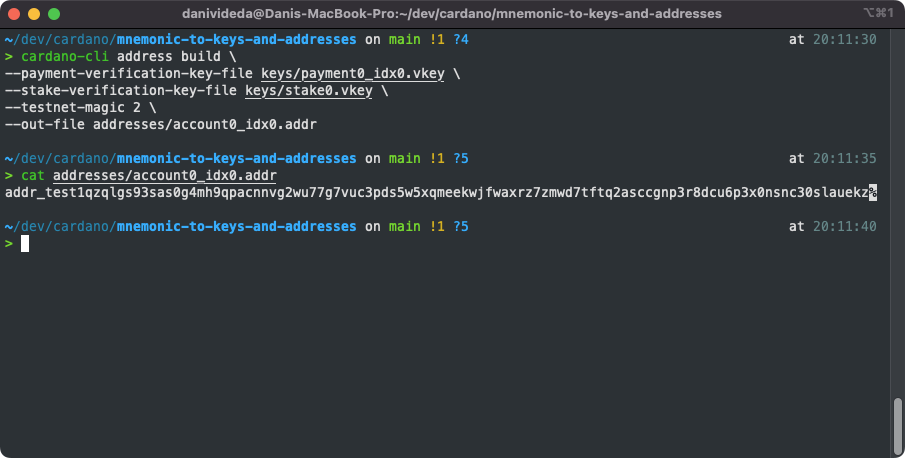
2. The prefix for testnet is `addr_test`.

### Build Addresses - Mainnet
Basically the same with the previous Testnet address, just replace the `--testnet-magic` with `--mainnet`

1. Build the address
   ```bash
   cardano-cli address build \
   --payment-verification-key-file keys/payment0_idx0.vkey \
   --stake-verification-key-file keys/stake0.vkey \
   --testnet-magic 2 \
   --out-file addresses/account0_idx0.addr
   ```
   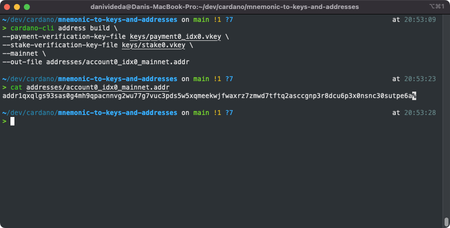
2. The prefix for mainnet is `addr`

**Done!**
Congratulations, you've created your own Cardano address from scratch using `cardano-wallet` and `cardano-cli`